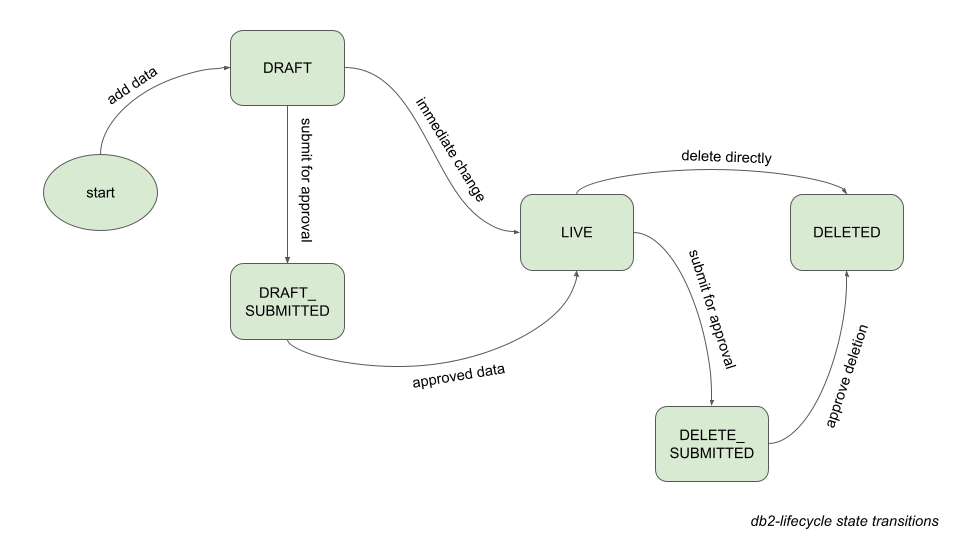

# db2-lifecycle
A simple Db2 for LUW module, providing building blocks for flexible lifecycle management.



## Synopsis
In many businesses there is a need for data lifecycle management, yet systems often insert and delete data without sufficient inbuilt controls. The LIFECYCLE module contains Db2 user-defined functions (UDFs) for maintaining and querying a lifecycle state that is represented by the bits of a SMALLINT value.

The module is designed to be simple, flexible and solution agnostic. It is not a complete solution but provides building blocks for integration into your designs, whether a clean sheet or a retrofit.

## Status
Candidate initial release, under evaluation.

## Quick installation instructions
1. Connect to your Db2 for LUW database.
1. Change to the ``db2`` directory.
1. The default schema is CHANGE. If you want to implement using a different schema name then edit file set_env.sql. Then execute the script to set the environment: ``db2 -tf set_env.sql``
1. Create the LIFECYCLE module: ``db2 -tf module_lifecycle.sql``
1. Create all of the module functions:
    ```
    db2 -td@ -f lifecycle/get_states.sql
    db2 -td@ -f lifecycle/is_state.sql
    db2 -td@ -f lifecycle/set_deleted.sql
    db2 -td@ -f lifecycle/set_delete_submitted.sql
    db2 -td@ -f lifecycle/set_draft.sql
    db2 -td@ -f lifecycle/set_draft_submitted.sql
    db2 -td@ -f lifecycle/set_live.sql
    ```

## Quick start examples
The LIFECYCLE functions are expected to be integrated into application code as part of your design. The following examples are meant only to illustrate how the functions can be called, using the Db2 CLP. Make sure that you are connected to the database with the same current schema and path as you used to create the functions.

Query output is indented.

### Initial state
Create global variable G_STATES and set the lifecycle state to DRAFT:
```
CREATE OR REPLACE VARIABLE g_states SMALLINT DEFAULT 0;

SET g_states = lifecycle.set_draft(g_states);

SELECT bit_index, state_code, lifecycle.is_state(g_states, state_code) AS is_state FROM TABLE(lifecycle.get_states());

    BIT_INDEX STATE_CODE           IS_STATE
    --------- -------------------- --------
            0 DELETED                     0
            1 DRAFT                       1
            2 LIVE                        0
            3 DRAFT_SUBMITTED             0
            4 DELETE_SUBMITTED            0
     
      5 record(s) selected.
```

In your application, the lifecycle state would not be a global variable but should be held in a SMALLINT column, for example: ``lifecycle_state SMALLINT NOT NULL DEFAULT 1`` (value 1 is a default of DRAFT)

A number of different types of data might benefit from having lifecycle management. For example, a row containing the lifecycle state column could represent be a new reference data row, to be added to the system after some approval process; or it could represent a draft insurance proprosal that is not yet a policy.

### Submit the draft for approval
This step represents finalisation of the draft, and submitting it for approval:
```
SET g_states = lifecycle.set_draft_submitted(g_states);

SELECT bit_index, state_code, lifecycle.is_state(g_states, state_code) AS is_state FROM TABLE(lifecycle.get_states());

    BIT_INDEX STATE_CODE           IS_STATE
    --------- -------------------- --------
            0 DELETED                     0
            1 DRAFT                       1
            2 LIVE                        0
            3 DRAFT_SUBMITTED             1
            4 DELETE_SUBMITTED            0
     
      5 record(s) selected.
```

### Approve the draft
The actual approval process is likely to be complex, and is delegated; it is not modelled by the LIFECYCLE module.

Once approvals have been obtained, the system can change the lifecycle state to LIVE:
```
SET g_states = lifecycle.set_live(g_states);

SELECT bit_index, state_code, lifecycle.is_state(g_states, state_code) AS is_state FROM TABLE(lifecycle.get_states());

    BIT_INDEX STATE_CODE           IS_STATE
    --------- -------------------- --------
            0 DELETED                     0
            1 DRAFT                       0
            2 LIVE                        1
            3 DRAFT_SUBMITTED             0
            4 DELETE_SUBMITTED            0
     
      5 record(s) selected.
```

In some designs, the draft data might be held in a separate table to live (approved) data. In such cases the system will move the row, as well as updating the lifecycle state.

If a draft is rejected, it would be appropriate to set the state back to DRAFT:
```
SET g_states = lifecycle.set_draft(g_states);
```

### Request approval to delete
When data needs to be deleted, there may need to be an approval process (similar to approving drafts). The DELETE_SUBMITTED state represents data that is submitted to approval to delete:
```
SET g_states = lifecycle.set_delete_submitted(g_states);

SELECT bit_index, state_code, lifecycle.is_state(g_states, state_code) AS is_state FROM TABLE(lifecycle.get_states());

    BIT_INDEX STATE_CODE           IS_STATE
    --------- -------------------- --------
            0 DELETED                     0
            1 DRAFT                       0
            2 LIVE                        1
            3 DRAFT_SUBMITTED             0
            4 DELETE_SUBMITTED            1
     
      5 record(s) selected.
```

### Approve the deletion
Once approvals to delete the data have been obtained, the system can change the lifecycle state to DELETED:
```
SET g_states = lifecycle.set_deleted(g_states);

SELECT bit_index, state_code, lifecycle.is_state(g_states, state_code) AS is_state FROM TABLE(lifecycle.get_states());

    BIT_INDEX STATE_CODE           IS_STATE
    --------- -------------------- --------
            0 DELETED                     1
            1 DRAFT                       0
            2 LIVE                        1
            3 DRAFT_SUBMITTED             0
            4 DELETE_SUBMITTED            0
     
      5 record(s) selected.
```

> Note: This is a pseudo-delete. An alternative is to physically delete the data.

> Note: In both this and the previous section, the state of LIVE is preserved throughout the approval and deletion process.

## Shortcut transitions
To permit flexibility, the module does not enforce a rigid lifecycle but allows certain shortcut state transitions:
- DRAFT can be set from any state
- LIVE can be set from any state (i.e. without approval)
- DELETED can be set from any state (i.e. without approval)

> Note: It is up to the application to further restrict transitions that are not permitted.

## Illegal state transitions
Although the module allows many state transitions, those that are nonsensical are blocked with SQLSTATE 22546:
```
SQL0438N  Application raised error or warning with diagnostic text: "Illegal 
lifecycle state transition".  SQLSTATE=22546
```
Note the following restrictions:
- DELETE_SUBMITTED can be set only from LIVE state
- DRAFT_SUBMITTED can be set only fron DRAFT state
